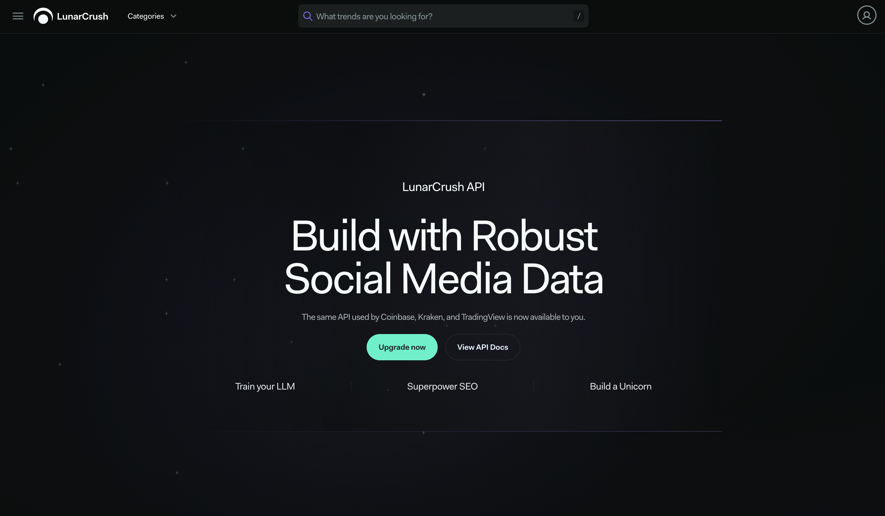
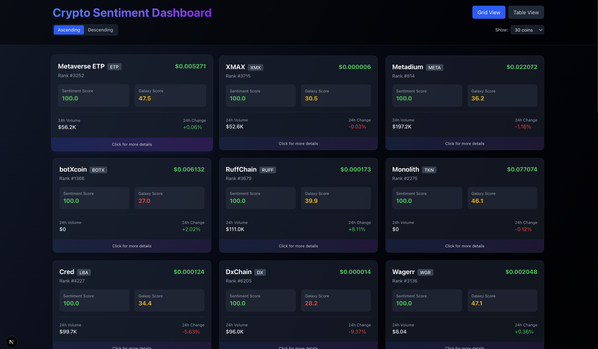
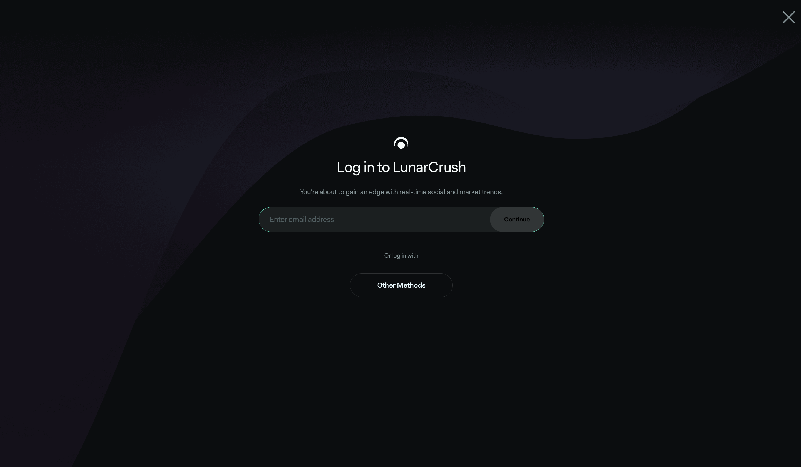
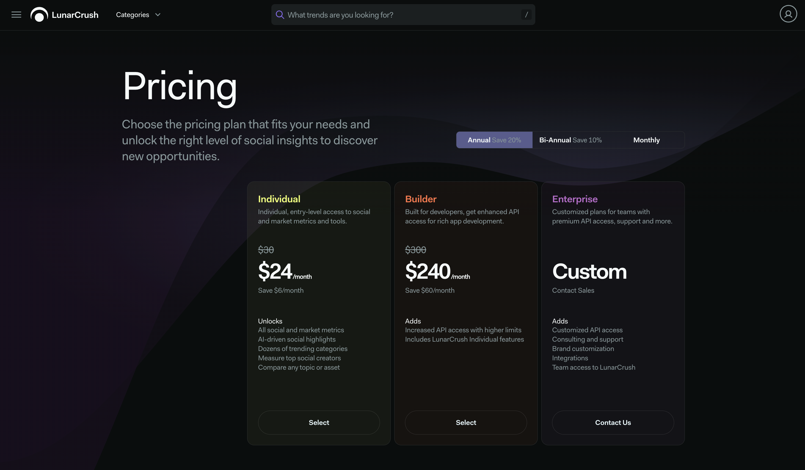
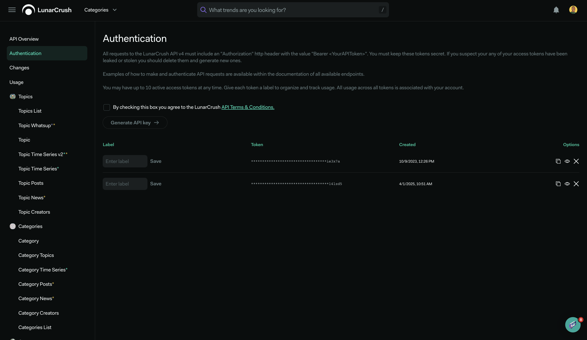
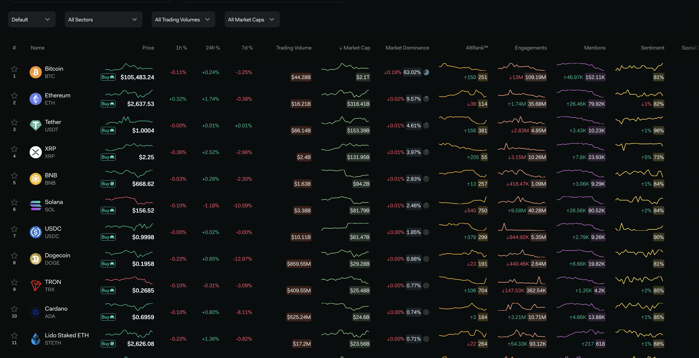

# Build a Crypto Sentiment Dashboard with Next.js in 20 Minutes



## Introduction

In today's volatile crypto market, having access to real-time sentiment data can give your users a significant edge. Social media sentiment has proven to be a powerful indicator for price movements, often preceding market shifts by hours or even days. This tutorial will show you how to integrate our powerful LunarCrush API into a Next.js application to create a beautiful, responsive dashboard displaying crypto sentiment data.

## What You'll Build



In this tutorial, you'll create a professional crypto sentiment dashboard that:

- ✅ Shows real-time social sentiment data for top cryptocurrencies
- ✅ Provides both grid and table views with visual sentiment indicators
- ✅ Includes responsive design for mobile and desktop
- ✅ Securely handles API authentication

**Time Investment:** ~20 minutes
**Skill Level:** Beginner to Intermediate
**What You'll Learn:** API integration, Next.js, error handling, data visualization

> 💡 **Pro Tip:** By the end, you'll have a production-ready dashboard you can deploy to impress clients or add to your portfolio!

## Before We Start

**You'll Need:**

- Node.js 18+ installed
- Basic knowledge of React and Next.js
- A code editor (VS Code recommended)
- A [LunarCrush API key](#sign-up-for-a-lunarcrush-account) (We'll walk through signup below)

**Quick Setup:**

```bash
# Create a new Next.js project
npx create-next-app@latest crypto-sentiment-dashboard
cd crypto-sentiment-dashboard
npm install react-syntax-highlighter
```

🚨 **Common Issue:** If you see authentication errors, double-check your API key format and that your subscription is active

## Sign Up For A LunarCrush Account

To access the LunarCrush API, you'll need to sign up for a paid plan (otherwise you'll use mock data):

1. Visit [LunarCrush Signup](https://lunarcrush.com/signup)
2. Enter your email address and click "Continue"
3. Check your email for a verification code and enter it
4. Complete the onboarding steps:
   - Select your favorite categories (or keep the defaults)
   - Create your profile (add a photo and nickname if desired)
   - **Important:** Select a subscription plan (you'll need at least an Individual plan to generate an API key)



### Available API Plans



| Plan           | Rate Limits               | Best For                            |
| -------------- | ------------------------- | ----------------------------------- |
| **Individual** | 10 requests/min, 2K/day   | Personal projects, learning         |
| **Builder**    | 100 requests/min, 20K/day | Professional apps, small businesses |
| **Enterprise** | Custom limits             | Large-scale applications            |

### Key Generation

Once you've subscribed, navigate to [https://www.lunarcrush.com/developers/api/authentication](https://www.lunarcrush.com/developers/api/authentication) and generate an API key.



## Step 1: Create a New Next.js Project

Let's start by creating a new Next.js project:

```bash
npx create-next-app@latest crypto-sentiment-dashboard
cd crypto-sentiment-dashboard
```

You may be prompted with some config options. Here are the options that were selected in the finished repo:

- Would you like to use TypeScript? > No
- Would you like to use ESLint? > Yes
- Would you like to use Tailwind CSS? > Yes
- Would you like to use `src/` directory? > No
- Would you like to use App Router? > Yes
- Would you like to customize the default import alias? > No

## Step 2: Install Required Dependencies

We'll need a few additional packages for our project:

```bash
npm install react-syntax-highlighter
```

## Step 3: Set Up Environment Variables

Create a `.env.local` file in the root of your project:

```bash
touch .env.local
```

Open this file and add your LunarCrush API key:

```env
LUNARCRUSH_API_TOKEN=your_api_key_here
```

Remember to replace `your_api_key_here` with your actual API key from LunarCrush.

## Step 4: Set Up Constants & Formatters

Create a directory constants:

```bash
mkdir -p app/constants
```

Create a new file `app/constants/index.js`:

```javascript
// app/constants/index.js
export const API_TOKEN = process.env.LUNARCRUSH_API_TOKEN;
export const BASE_URL = 'https://lunarcrush.com/api4/public/';

// Default display settings
export const DEFAULT_LIMIT = 30;
export const DEFAULT_SORT_DESCENDING = true;
export const AVAILABLE_DISPLAY_LIMITS = [10, 20, 30, 50, 100];

// Sentiment score thresholds for color coding
export const SENTIMENT_THRESHOLDS = {
 HIGH: 70, // High (Green)
 MEDIUM: 50, // Medium-high (Blue)
 LOW: 30, // Medium (Yellow)
 // Below 30 is considered poor (Red)
};

// API-related constants
export const API_ENDPOINTS = {
 SENTIMENT: '/api/sentiment',
};

// UI-related constants
export const VIEW_MODES = {
 GRID: 'grid',
 TABLE: 'table',
};

// Data refresh intervals (in milliseconds)
export const REFRESH_INTERVALS = {
 AUTO: 60000, // 1 minute auto-refresh
};

// Helpful descriptions for metrics (for tooltips or explanations)
export const METRIC_DESCRIPTIONS = {
 SENTIMENT:
  'Sentiment score represents the overall attitude from social media posts. Higher scores (0-100) indicate more positive sentiment.',
 GALAXY_SCORE:
  'Galaxy score is a proprietary rating that combines social activity, market activity, and price performance into a single score (0-100).',
 MARKET_CAP:
  'The total value of all coins currently in circulation (price × circulating supply).',
 VOLUME: 'The total amount of coins traded in the last 24 hours.',
 PRICE_CHANGE:
  'Percentage change in coin price over the specified time period.',
};
```

Create a directory utils:

```bash
mkdir -p app/utils
```

Create a new file `app/utils/formatters.js`:

```javascript
// app/utils/formatters.js
/**
 * Formats a timestamp into a human-readable "time ago" string
 * @param {number} timestamp - The timestamp to format (milliseconds since epoch)
 * @returns {string} A human-readable time string (e.g., "5 minutes ago")
 */
export const formatTimeSince = (timestamp) => {
 if (!timestamp) return 'N/A';

 const seconds = Math.floor((Date.now() - timestamp) / 1000);

 if (seconds < 60) return `${seconds} seconds ago`;
 if (seconds < 3600) return `${Math.floor(seconds / 60)} minutes ago`;
 if (seconds < 86400) return `${Math.floor(seconds / 3600)} hours ago`;
 return `${Math.floor(seconds / 86400)} days ago`;
};

/**
 * Formats large numbers to be more readable (e.g., 1000000 -> 1.0M)
 * @param {number} num - The number to format
 * @returns {string} Formatted number with K (thousands) or M (millions) suffix
 */
export const formatNumber = (num) => {
 if (!num && num !== 0) return 'N/A';

 if (num >= 1000000) {
  return (num / 1000000).toFixed(1) + 'M'; // Millions
 } else if (num >= 1000) {
  return (num / 1000).toFixed(1) + 'K'; // Thousands
 }
 return num.toString(); // Small numbers unchanged
};

/**
 * Formats a price value with appropriate decimal places
 * @param {number} price - The price to format
 * @param {Object} options - Formatting options
 * @returns {string} Formatted price string
 */
export const formatPrice = (price, options = {}) => {
 if (price == null) return 'N/A';

 const defaultOptions = {
  minimumFractionDigits: 2,
  maximumFractionDigits: 6,
  ...options,
 };

 return Number(price).toLocaleString(undefined, defaultOptions);
};

/**
 * Formats a percentage value with a + or - sign and fixed decimal places
 * @param {number} percent - The percentage value to format
 * @param {number} decimals - Number of decimal places (default: 2)
 * @returns {string} Formatted percentage string with sign
 */
export const formatPercentage = (percent, decimals = 2) => {
 if (percent == null) return 'N/A';

 const sign = percent >= 0 ? '+' : '';
 return `${sign}${percent.toFixed(decimals)}%`;
};
```

## Step 5: Create API Service

Let's create an API service to handle communication with the LunarCrush API.

First, create a route handler for our sentiment endpoint:

```bash
mkdir -p app/api/sentiment
```

Create a new file `app/api/sentiment/route.js`:

```javascript
// app/api/sentiment/route.js
import { NextResponse } from 'next/server';

/**
 * API configuration
 * - API_TOKEN: The authentication token from your .env.local file
 * - BASE_URL: The base URL for the LunarCrush API
 * - DEFAULT_LIMIT: Default number of coins to fetch if not specified
 */
import { DEFAULT_LIMIT, API_TOKEN, BASE_URL } from '@/app/constants';

/**
 * GET handler for the sentiment endpoint
 *
 * This function fetches cryptocurrency sentiment data from the LunarCrush API.
 * It accepts query parameters for sorting order and limiting results.
 *
 * @param {Request} request - The incoming HTTP request
 * @returns {Response} JSON response with cryptocurrency data or error message
 */
export async function GET(request) {
 try {
  // Step 1: Check if API token is available
  if (!API_TOKEN) {
   throw new Error(
    'API_TOKEN is missing. Please set LUNARCRUSH_API_TOKEN in .env.local'
   );
  }

  // Step 2: Extract query parameters from the URL
  const { searchParams } = new URL(request.url);

  // 'desc=1' means sort in descending order
  const desc = searchParams.get('desc') === '1' ? 1 : 0;

  // Get the limit or use default
  const limit = searchParams.get('limit')
   ? parseInt(searchParams.get('limit'))
   : DEFAULT_LIMIT;

  // Step 3: Construct the API URL with query parameters
  const apiUrl = `${BASE_URL}coins/list/v1?sort=altrank&limit=${limit}${
   desc ? '&desc=1' : ''
  }`;

  // Step 4: Make the API request
  const response = await fetch(apiUrl, {
   headers: {
    Authorization: `Bearer ${API_TOKEN}`,
    'Content-Type': 'application/json',
   },
  });

  // Step 5: Check for successful response
  if (!response.ok) {
   throw new Error(`API Error: ${response.status}`);
  }

  // Step 6: Parse and return the JSON data
  const data = await response.json();
  return NextResponse.json(data);
 } catch (error) {
  // Error handling
  console.error('Failed to fetch sentiment data:', error);
  let errorMessage = 'Failed to fetch data';

  // Provide a more helpful error message for missing API token
  if (error.message.includes('API_TOKEN is missing')) {
   errorMessage =
    'Missing API key. Please set LUNARCRUSH_API_TOKEN in .env.local';
  }

  return NextResponse.json({ error: errorMessage }, { status: 500 });
 }
}
```

Now, create a service to fetch data from our API endpoint. First, let's create a directory for services and a mock data file for fallback:

```bash
mkdir -p app/services app/data
```

Create a mock data file `app/data/mockData.js` that we'll use as a fallback if API access fails:

```javascript
// app/data/mockData.js
export const mockData = {
  config: {
    generated: Date.now(),
  },
  data: [
    {
      id: 1,
      symbol: 'BTC',
      name: 'Bitcoin',
      price: 57890.45,
      price_btc: 1,
      volume_24h: 38245912345,
      volatility: 2.3,
      circulating_supply: 19356212,
      max_supply: 21000000,
      percent_change_1h: 0.23,
      percent_change_24h: 1.45,
      percent_change_7d: 5.32,
      market_cap: 1121345678901,
      market_cap_rank: 1,
      interactions_24h: 568942,
      social_volume_24h: 349851,
      social_dominance: 14.32,
      market_dominance: 52.1,
      galaxy_score: 75,
      sentiment: 85,
      logo: 'https://cdn.lunarcrush.com/bitcoin.png',
      rank: 1,
    },
    {
      id: 2,
      symbol: 'ETH',
      name: 'Ethereum',
      price: 3240.78,
      price_btc: 0.055982,
      volume_24h: 21359847102,
      volatility: 2.8,
      circulating_supply: 120532451,
      max_supply: null,
      percent_change_1h: 0.14,
      percent_change_24h: 2.34,
      percent_change_7d: 7.15,
      market_cap: 390821345678,
      market_cap_rank: 2,
      interactions_24h: 412358,
      social_volume_24h: 278945,
      social_dominance: 11.23,
      market_dominance: 18.7,
      galaxy_score: 72,
      sentiment: 82,
      logo: 'https://cdn.lunarcrush.com/ethereum.png',
      rank: 2,
    },
    // Add more mock crypto data as needed
  ],
};
```

Now create the API service file `app/services/lunarcrush.js`:

```javascript
// app/services/lunarcrush.js
import { mockData } from '../data/mockData';

/**
 * LunarCrush API Service
 * ======================
 *
 * This service handles all communication with the LunarCrush API through
 * our backend API route. It provides methods for fetching cryptocurrency
 * sentiment data and includes error handling and fallback mechanisms.
 *
 * Key concepts:
 *
 * 1. API Endpoint: We don't call the LunarCrush API directly from the frontend.
 *    Instead, we call our own backend API route (/api/sentiment) which then
 *    securely forwards the request to LunarCrush with proper authentication.
 *
 * 2. Mock Data: For development or when API access fails, we provide mock
 *    data that mimics the structure of real API responses.
 *
 * 3. Error Handling: All API calls are wrapped in try/catch blocks to
 *    ensure the application doesn't crash if the API is unavailable.
 */

/**
 * Fetches cryptocurrency sentiment data from our API endpoint
 *
 * This function tries to get real data from the LunarCrush API via our
 * backend endpoint. If the request fails (e.g., no API key), it falls
 * back to using mock data for demonstration purposes.
 *
 * @param {Object} params - Query parameters
 * @param {boolean} params.desc - Sort in descending order if true (1 = descending, 0 = ascending)
 * @param {number} params.limit - Number of results to return (e.g., 10, 30, 100)
 * @returns {Promise<Object>} The cryptocurrency data with structure matching the LunarCrush API
 * @example
 * // Fetch the top 20 cryptocurrencies sorted by sentiment (highest first)
 * const data = await getSentimentData({ desc: 1, limit: 20 });
 */
export async function getSentimentData(params = {}) {
 try {
  // Step 1: Build the query string from parameters
  const queryParams = new URLSearchParams();

  // Add sorting parameter (1 = descending, 0 = ascending)
  if (params.desc !== undefined) {
   queryParams.append('desc', params.desc ? '1' : '0');
  }

  // Add limit parameter if provided
  if (params.limit !== undefined) {
   queryParams.append('limit', params.limit.toString());
  }

  // Step 2: Construct the full URL with query parameters
  const url = `/api/sentiment${
   queryParams.toString() ? `?${queryParams.toString()}` : ''
  }`;

  // Step 3: Make the API request to our backend
  console.log('Fetching data from:', url);
  const response = await fetch(url);

  // Step 4: Check if the response is successful
  if (!response.ok) {
   throw new Error(`API Error: ${response.status}`);
  }

  // Step 5: Parse and return JSON data
  return await response.json();
 } catch (error) {
  // Error handling - use mock data as fallback
  console.error('Failed to fetch sentiment data:', error);
  console.warn(
   'Using mock data as fallback - this helps during development or when API access is unavailable'
  );

  // Step 1: Create a copy of mock data with a flag indicating it's mock data
  let result = {
   ...mockData,
   usedMockData: true, // This flag helps the UI show a notification
  };

  // Step 2: Sort the mock data if descending parameter was provided
  if (params.desc) {
   result = {
    ...result,
    // Create a new sorted array without modifying the original
    data: [...result.data].reverse(),
   };
  }

  // Step 3: Apply limit to the mock data if requested
  if (params.limit) {
   result = {
    ...result,
    data: result.data.slice(0, params.limit),
   };
  }

  return result;
 }
}

```

## Step 5: Create the Dashboard UI

Now let's update the main page component to display our sentiment data. Replace the content of `app/page.js` with the following:

```javascript
'use client';

import { useEffect, useState, useCallback } from 'react';
import { getSentimentData } from './services/lunarcrush';

export default function Home() {
  const [data, setData] = useState([]);
  const [loading, setLoading] = useState(true);
  const [error, setError] = useState(null);
  const [activeTab, setActiveTab] = useState('grid');
  const [isDescending, setIsDescending] = useState(true);
  const [displayLimit, setDisplayLimit] = useState(30);
  const [useMockData, setUseMockData] = useState(false);

  const limitOptions = [10, 20, 30, 50, 100];

  // Format numbers with commas
  const formatNumber = (num) => {
    if (num === undefined || num === null) return 'N/A';
    return new Intl.NumberFormat('en-US').format(num);
  };

  // Format currency values
  const formatCurrency = (num) => {
    if (num === undefined || num === null) return 'N/A';
    if (num >= 1e9) return `$${(num / 1e9).toFixed(2)}B`;
    if (num >= 1e6) return `$${(num / 1e6).toFixed(2)}M`;
    if (num >= 1e3) return `$${(num / 1e3).toFixed(2)}K`;
    return `$${num.toFixed(2)}`;
  };

  // Format price based on value
  const formatPrice = (price) => {
    if (price === undefined || price === null) return 'N/A';
    if (price >= 1000) return `$${price.toFixed(2)}`;
    if (price >= 1) return `$${price.toFixed(2)}`;
    if (price >= 0.01) return `$${price.toFixed(4)}`;
    return `$${price.toFixed(8)}`;
  };

  // Format percent changes
  const formatPercentChange = (value) => {
    if (value === undefined || value === null) return 'N/A';
    return `${value >= 0 ? '+' : ''}${value.toFixed(2)}%`;
  };

  const fetchCryptoData = useCallback(async () => {
    setLoading(true);
    setError(null);

    try {
      const result = await getSentimentData({
        desc: isDescending,
        limit: displayLimit,
      });

      // Check if mock data was returned
      if (result.usedMockData) {
        setUseMockData(true);
        console.log('⚠️ Using mock data (API key missing or error occurred)');
      }

      const processedData = result.data.map((coin, index) => {
        return {
          ...coin,
          rank: coin.market_cap_rank || coin.alt_rank || index + 1,
          sentiment: coin.sentiment ?? 0,
          galaxy_score: coin.galaxy_score ?? 0,
          percent_change_24h: coin.percent_change_24h ?? 0,
          percent_change_7d: coin.percent_change_7d ?? 0,
          volume_24h: coin.volume_24h ?? 0,
          market_cap: coin.market_cap ?? 0,
          price: coin.price ?? 0,
        };
      });

      setData(processedData);
      setLoading(false);
    } catch (err) {
      console.error('Error in fetchCryptoData:', err);
      setError('Failed to load data. Check your API token in .env.local.');
      setLoading(false);
    }
  }, [isDescending, displayLimit]);

  useEffect(() => {
    fetchCryptoData();

    // Auto-refresh every 5 minutes
    const intervalId = setInterval(() => {
      fetchCryptoData();
    }, 5 * 60 * 1000);

    return () => clearInterval(intervalId);
  }, [fetchCryptoData]);

  // Function to determine color based on sentiment score
  const getSentimentColor = (score) => {
    if (score >= 80) return 'bg-green-500';
    if (score >= 60) return 'bg-green-300';
    if (score >= 40) return 'bg-yellow-300';
    if (score >= 20) return 'bg-orange-400';
    return 'bg-red-500';
  };

  return (
    <main className="flex min-h-screen flex-col items-center p-4 md:p-8 bg-gray-50">
      <header className="w-full max-w-7xl mb-8">
        <h1 className="text-3xl md:text-4xl font-bold text-gray-800 mb-2">
          Crypto Sentiment Dashboard
        </h1>
        <p className="text-gray-600">
          Social sentiment data for top cryptocurrencies
          {useMockData && " (Using mock data - for subscription info see below)"}
        </p>

        <div className="mt-6 flex flex-wrap gap-4 items-center">
          <div className="flex space-x-2 items-center">
            <label htmlFor="displayLimit" className="text-sm text-gray-700">
              Display:
            </label>
            <select
              id="displayLimit"
              value={displayLimit}
              onChange={(e) => setDisplayLimit(Number(e.target.value))}
              className="bg-white border border-gray-300 rounded-md py-1 px-3 text-sm focus:outline-none focus:ring-2 focus:ring-blue-500"
            >
              {limitOptions.map((limit) => (
                <option key={limit} value={limit}>
                  {limit}
                </option>
              ))}
            </select>
          </div>

          <div className="flex space-x-2 items-center">
            <label htmlFor="sortOrder" className="text-sm text-gray-700">
              Sort:
            </label>
            <select
              id="sortOrder"
              value={isDescending ? 'desc' : 'asc'}
              onChange={(e) => setIsDescending(e.target.value === 'desc')}
              className="bg-white border border-gray-300 rounded-md py-1 px-3 text-sm focus:outline-none focus:ring-2 focus:ring-blue-500"
            >
              <option value="desc">Highest Sentiment First</option>
              <option value="asc">Lowest Sentiment First</option>
            </select>
          </div>

          <button
            onClick={() => fetchCryptoData()}
            className="ml-auto inline-flex items-center gap-1 bg-blue-600 hover:bg-blue-700 text-white py-2 px-4 rounded-md transition"
          >
            <svg xmlns="http://www.w3.org/2000/svg" className="h-4 w-4" fill="none" viewBox="0 0 24 24" stroke="currentColor">
              <path strokeLinecap="round" strokeLinejoin="round" strokeWidth={2} d="M4 4v5h.582m15.356 2A8.001 8.001 0 004.582 9m0 0H9m11 11v-5h-.581m0 0a8.003 8.003 0 01-15.357-2m15.357 2H15" />
            </svg>
            Refresh
          </button>
        </div>

        <div className="mt-4 flex border-b border-gray-200">
          <button
            className={`py-2 px-4 ${
              activeTab === 'grid'
                ? 'border-b-2 border-blue-500 text-blue-600'
                : 'text-gray-600'
            }`}
            onClick={() => setActiveTab('grid')}
          >
            Grid View
          </button>
          <button
            className={`py-2 px-4 ${
              activeTab === 'table'
                ? 'border-b-2 border-blue-500 text-blue-600'
                : 'text-gray-600'
            }`}
            onClick={() => setActiveTab('table')}
          >
            Table View
          </button>
        </div>
      </header>

      {useMockData && (
        <div className="w-full max-w-7xl bg-blue-50 border border-blue-200 rounded-lg p-4 mb-8">
          <p className="text-blue-800">
            <strong>Note:</strong> You're currently viewing mock data. To see real-time sentiment data,
            <a href="https://lunarcrush.com/" target="_blank" rel="noopener noreferrer" className="text-blue-600 font-medium hover:underline"> sign up for a LunarCrush subscription</a> and add your API key to the .env.local file.
          </p>
        </div>
      )}

      {error ? (
        <div className="w-full max-w-7xl bg-red-50 border border-red-200 rounded-lg p-4 mb-8">
          <p className="text-red-600">{error}</p>
        </div>
      ) : null}

      {loading ? (
        <div className="w-full max-w-7xl flex justify-center items-center p-12">
          <div className="animate-spin rounded-full h-12 w-12 border-t-2 border-b-2 border-blue-500"></div>
        </div>
      ) : (
        <>
          {activeTab === 'grid' ? (
            <div className="w-full max-w-7xl grid grid-cols-1 sm:grid-cols-2 lg:grid-cols-3 xl:grid-cols-4 gap-4">
              {data.map((coin) => (
                <div
                  key={coin.id}
                  className="bg-white rounded-lg shadow overflow-hidden hover:shadow-lg transition"
                >
                  <div className="p-4">
                    <div className="flex items-center">
                      {coin.logo ? (
                        
                      ) : (
                        <div className="w-8 h-8 mr-2 bg-gray-200 rounded-full" />
                      )}
                      <div>
                        <div className="flex items-center">
                          <h3 className="font-medium text-gray-900">
                            {coin.symbol}
                          </h3>
                          <span className="text-xs text-gray-500 ml-2">
                            #{coin.rank || 'N/A'}
                          </span>
                        </div>
                        <p className="text-xs text-gray-500">{coin.name}</p>
                      </div>
                    </div>

                    <div className="mt-4 space-y-2">
                      <div>
                        <p className="text-xs text-gray-500 mb-1">Sentiment</p>
                        <div className="flex items-center">
                          <div className="w-full bg-gray-200 rounded-full h-2">
                            <div
                              className={`h-2 rounded-full ${getSentimentColor(
                                coin.sentiment
                              )}`}
                              style={{ width: `${coin.sentiment}%` }}
                            ></div>
                          </div>
                          <span className="ml-2 text-sm font-medium">
                            {coin.sentiment}
                          </span>
                        </div>
                      </div>

                      <div className="flex justify-between">
                        <div>
                          <p className="text-xs text-gray-500">Price</p>
                          <p className="font-medium">
                            {formatPrice(coin.price)}
                          </p>
                        </div>
                        <div className="text-right">
                          <p className="text-xs text-gray-500">24h Change</p>
                          <p
                            className={`font-medium ${
                              coin.percent_change_24h >= 0
                                ? 'text-green-600'
                                : 'text-red-600'
                            }`}
                          >
                            {formatPercentChange(coin.percent_change_24h)}
                          </p>
                        </div>
                      </div>

                      <div className="flex justify-between">
                        <div>
                          <p className="text-xs text-gray-500">Market Cap</p>
                          <p className="font-medium">
                            {formatCurrency(coin.market_cap)}
                          </p>
                        </div>
                        <div className="text-right">
                          <p className="text-xs text-gray-500">Volume (24h)</p>
                          <p className="font-medium">
                            {formatCurrency(coin.volume_24h)}
                          </p>
                        </div>
                      </div>
                    </div>
                  </div>
                </div>
              ))}
            </div>
          ) : (
            <div className="w-full max-w-7xl overflow-x-auto">
              <table className="min-w-full bg-white">
                <thead>
                  <tr className="bg-gray-100 text-gray-700 text-sm leading-normal">
                    <th className="py-3 px-4 text-left">#</th>
                    <th className="py-3 px-4 text-left">Coin</th>
                    <th className="py-3 px-4 text-left">Price</th>
                    <th className="py-3 px-4 text-right">24h Change</th>
                    <th className="py-3 px-4 text-right">Market Cap</th>
                    <th className="py-3 px-4 text-right">Volume (24h)</th>
                    <th className="py-3 px-4 text-right">Sentiment</th>
                  </tr>
                </thead>
                <tbody className="text-gray-700 text-sm">
                  {data.map((coin) => (
                    <tr
                      key={coin.id}
                      className="border-b border-gray-200 hover:bg-gray-50"
                    >
                      <td className="py-3 px-4">{coin.rank || 'N/A'}</td>
                      <td className="py-3 px-4">
                        <div className="flex items-center">
                          {coin.logo ? (
                            
                          ) : (
                            <div className="w-6 h-6 mr-2 bg-gray-200 rounded-full" />
                          )}
                          <div>
                            <p className="font-medium">{coin.symbol}</p>
                            <p className="text-xs text-gray-500">{coin.name}</p>
                          </div>
                        </div>
                      </td>
                      <td className="py-3 px-4">{formatPrice(coin.price)}</td>
                      <td
                        className={`py-3 px-4 text-right ${
                          coin.percent_change_24h >= 0
                            ? 'text-green-600'
                            : 'text-red-600'
                        }`}
                      >
                        {formatPercentChange(coin.percent_change_24h)}
                      </td>
                      <td className="py-3 px-4 text-right">
                        {formatCurrency(coin.market_cap)}
                      </td>
                      <td className="py-3 px-4 text-right">
                        {formatCurrency(coin.volume_24h)}
                      </td>
                      <td className="py-3 px-4 text-right">
                        <div className="flex items-center justify-end">
                          <div className="w-24 bg-gray-200 rounded-full h-2 mr-2">
                            <div
                              className={`h-2 rounded-full ${getSentimentColor(
                                coin.sentiment
                              )}`}
                              style={{ width: `${coin.sentiment}%` }}
                            ></div>
                          </div>
                          <span>{coin.sentiment}</span>
                        </div>
                      </td>
                    </tr>
                  ))}
                </tbody>
              </table>
            </div>
          )}
        </>
      )}

      <footer className="w-full max-w-7xl mt-12 text-center text-gray-500 text-sm">
        <p>
          Data powered by{' '}
          <a
            href="https://lunarcrush.com"
            target="_blank"
            rel="noopener noreferrer"
            className="text-blue-600 hover:underline"
          >
            LunarCrush
          </a>
        </p>
      </footer>
    </main>
  );
}
```

## Step 6: Update CSS (Optional)

The existing Tailwind configuration should be sufficient, but make sure your `globals.css` file has the Tailwind directives:

```css
@tailwind base;
@tailwind components;
@tailwind utilities;
```

## Step 7: Run Your Application

Now let's start the development server:

```bash
npm run dev
```

Visit [http://localhost:3000](http://localhost:3000) to see your crypto sentiment dashboard in action!

### Final Dashboard

At this point, you should see your crypto sentiment dashboard with data displayed. There are two possibilities:

1. **Real API Data** - If you have an active LunarCrush subscription and correctly set up your `.env.local` file with a valid API key
2. **Mock Data** - If you don't have a subscription, our fallback system will automatically display sample data

You'll know you're seeing mock data if you see a notification in the browser console and at the top of your dashboard. This is perfect for development and learning purposes!

**Live Example:** You can see a deployed version of this dashboard at [crypto-sentiment-demo.vercel.app](https://nextjs-lunarcrush-sentimentv2.vercel.app/)

## How It Works



Let's break down what's happening in our application (in simple terms):

1. **API Integration**: We created a special route in our Next.js app that securely talks to the LunarCrush API. This keeps your API key safe on the server.

2. **Data Fallback**: We try to fetch real sentiment data, but if that fails (like if you don't have a subscription), we use pre-made sample data instead.

3. **User Interface**: We show the data in two ways - a pretty grid of cards and a detailed table. Each view includes visual indicators like colored bars to show sentiment strength.

4. **Responsive Design**: The dashboard looks great on phones, tablets, and computers - it adjusts automatically to fit any screen size.

## Troubleshooting Common Issues

Here are solutions to the most common problems you might encounter:

| Issue                           | Solution                                                                                                                                    |
| ------------------------------- | ------------------------------------------------------------------------------------------------------------------------------------------- |
| **Seeing Mock Data**            | This is expected if you don't have an active LunarCrush subscription. To get real data, [sign up for a plan](https://lunarcrush.com/signup) |
| **401 Unauthorized Error**      | Your API key is invalid or expired. Verify you have an active subscription and check the key format in your .env.local file                 |
| **"Cannot find module" Errors** | Make sure you've created all the necessary directories and files. Pay special attention to directory names and capitalization               |
| **CORS Errors**                 | Never call the API directly from the frontend. Always use the Next.js API route as shown in this tutorial                                   |
| **Rate Limiting**               | Individual plan is limited to 10 requests/minute. If you hit this limit, add caching or reduce refresh frequency                            |
| **Blank/Empty Screen**          | Check your browser console for JavaScript errors. Most likely a component is failing to render because of missing data                      |

**🔍 Pro Debugging Tip:** Add `console.log` statements throughout your code to see what's happening at each step. For example:

```javascript
// Inside your fetchCryptoData function
console.log('About to fetch data with these params:', params);
const result = await getSentimentData(params);
console.log('API response received:', result);
```

## Level Up: Adding Advanced Features

Want to make this dashboard more powerful? Let's add some advanced features:

### Option 1: Real-Time WebSocket Updates

For truly real-time data, you can upgrade to WebSocket connections:

```javascript
// websocket-client.js
import { useEffect, useState } from 'react';

export function useWebSocketData() {
  const [data, setData] = useState([]);
  const [status, setStatus] = useState('disconnected');

  useEffect(() => {
    const ws = new WebSocket('wss://yourapiendpoint/sentiment');

    ws.onopen = () => {
      setStatus('connected');
      ws.send(JSON.stringify({ action: 'subscribe', token: process.env.LUNARCRUSH_API_TOKEN }));
    };

    ws.onmessage = (event) => {
      const newData = JSON.parse(event.data);
      setData(newData.data);
    };

    ws.onclose = () => setStatus('disconnected');
    ws.onerror = () => setStatus('error');

    return () => {
      ws.close();
    };
  }, []);

  return { data, status };
}
```

### Option 2: AI-Powered Insights

Add AI-generated market insights using OpenAI's API:

```javascript
// services/ai-insights.js
async function generateInsights(topCoins) {
  const openaiApiKey = process.env.OPENAI_API_KEY;

  const prompt = `Based on these crypto sentiment scores and price changes:
  ${topCoins.map(c => `${c.name}: Sentiment=${c.sentiment}, 24h Change=${c.percent_change_24h}%`).join('\n')}

  Provide 3 brief market insights about trends, correlations, or notable movements.`;

  const response = await fetch('https://api.openai.com/v1/completions', {
    method: 'POST',
    headers: {
      'Content-Type': 'application/json',
      'Authorization': `Bearer ${openaiApiKey}`
    },
    body: JSON.stringify({
      model: "gpt-4-turbo",
      prompt,
      max_tokens: 200
    })
  });

  const data = await response.json();
  return data.choices[0].text.trim().split('\n');
}
```

🤖 **AI Prompt for Advanced Features:**

```text
"Add an AI-powered sentiment analysis component to my crypto dashboard that
summarizes the top trends and provides trading signals based on sentiment data"
```

### Option 3: Customizable Alerts

Add functionality for users to set sentiment alerts:

```javascript
// Add this to your main component
const [alerts, setAlerts] = useState(
  JSON.parse(localStorage.getItem('sentimentAlerts') || '{}')
);

const setAlert = (coinSymbol, threshold) => {
  const newAlerts = { ...alerts, [coinSymbol]: threshold };
  setAlerts(newAlerts);
  localStorage.setItem('sentimentAlerts', JSON.stringify(newAlerts));
};

// Check for triggered alerts in useEffect after data fetching
const checkAlerts = () => {
  const triggeredAlerts = [];

  data.forEach(coin => {
    if (alerts[coin.symbol] && coin.sentiment >= alerts[coin.symbol]) {
      triggeredAlerts.push(`${coin.name} (${coin.symbol}) reached sentiment threshold: ${coin.sentiment}`);
    }
  });

  if (triggeredAlerts.length > 0) {
    // Show notification or alert UI
    console.log('Alerts triggered:', triggeredAlerts);
  }
};
```

## Deploy Your App

Ready to share your crypto sentiment dashboard with the world? Here are the easiest ways to deploy it:

**Deploy on Vercel:**

[](https://vercel.com/new)

Check out the [Next.js deployment documentation](https://nextjs.org/docs/app/getting-started/deploying)

**Deployment Steps:**

1. Push your code to GitHub
2. Connect your repository to Vercel or Netlify
3. Configure the environment variable: `LUNARCRUSH_API_TOKEN`
4. Deploy your application
5. Visit your new domain to see your dashboard live!

**Security Tip:** Always use environment variables for API keys and never commit them directly to your repo.

## Using AI to Extend Your Project

### AI Prompt Templates

Here are some example AI prompts you can try to extend this project:

#### Component Generation

```javascript
// Prompt: Create a React component for a crypto sentiment watchlist that allows users to add and remove cryptocurrencies.
// It should store the watchlist in localStorage and display the sentiment data for each watched cryptocurrency.
// Use the following structure for the crypto data:
{
  id: number,
  symbol: string,
  name: string,
  price: number,
  sentiment: number,
  percent_change_24h: number,
  market_cap: number,
  volume_24h: number,
  logo: string
}
```

#### Error Handling

```text
Write a comprehensive error handling system for a Next.js app that fetches cryptocurrency data from an external API. Include handling for missing API keys, network errors, rate limiting, and unexpected data formats. Also include a user-friendly error display component with appropriate messaging.
```

#### Styling/UI

```text
Design a dark mode toggle component for a Next.js and Tailwind CSS crypto dashboard. The component should persist the user's preference in localStorage, include smooth transitions between modes, and update all relevant UI elements. Include implementation instructions.
```

#### Testing

```text
Create Jest test cases for a crypto sentiment dashboard that fetches data from an API. Include tests for loading states, successful data rendering, error handling, and user interactions like sorting and filtering. Use React Testing Library and mock the API responses.
```

#### Deployment

```text
Provide step-by-step instructions to deploy a Next.js crypto dashboard to Vercel, including environment variable configuration for the API key. The instructions should cover optimizing for performance, setting up continuous deployment from GitHub, and configuring custom domains.
```

## 📁 Complete Code

**GitHub Repository:** [github.com/yourusername/crypto-sentiment-dashboard](https://github.com/danilobatson/nextjs-lunarcrush-sentiment)

- ⭐ Star the repo if this helped!
- 🍴 Fork it to customize further
- 🐛 Report issues or suggestions

### Connect With Me on LinkedIn

If you found this tutorial helpful, I'd love to connect with you on LinkedIn! Feel free to reach out with questions, feedback, or just to share what you've built with this project.

[](https://www.linkedin.com/in/danilo-batson)

**Included in Repo:**

- Complete source code
- Environment setup guide
- Deployment instructions
- Additional examples

## Conclusion

Congratulations! You've successfully built a professional crypto sentiment dashboard using Next.js and the LunarCrush API. This dashboard provides your users with valuable insights into crypto market sentiment, which can help inform their investment decisions.

### What's Next?

**Extend Your App:**

- Add user authentication
- Implement data caching

## 🚀 Ready to Build More?

**[Subscribe To Access API](https://lunarcrush.com/signup)** | **[View Pricing Plans](https://lunarcrush.com/pricing)**


## Resources

- [LunarCrush API Documentation](https://lunarcrush.com/developers/api/endpoints)
- [LunarCrush Pricing Plans](https://lunarcrush.com/pricing)
- [Next.js Documentation](https://nextjs.org/docs)
- [Tailwind CSS Documentation](https://tailwindcss.com/docs)

---
